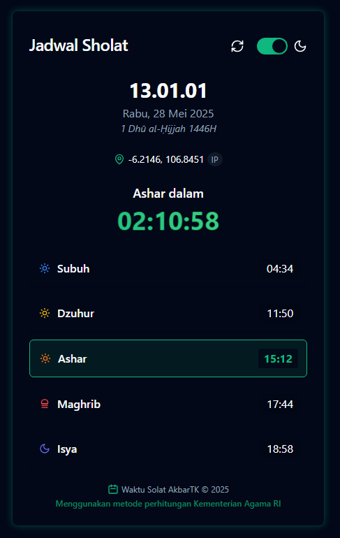
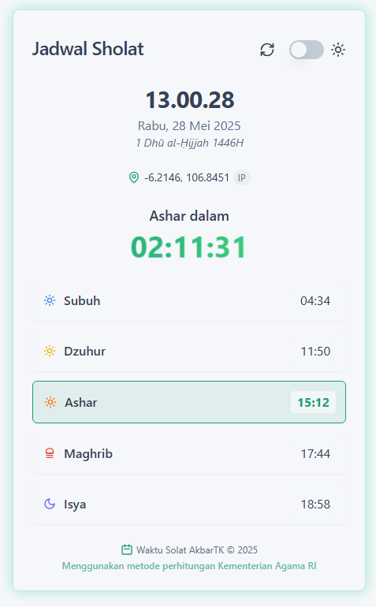

# Global Prayer Times - Aplikasi Waktu Sholat Sedunia 🌍

Aplikasi jadwal sholat global yang menyediakan waktu sholat Islam yang akurat untuk seluruh dunia berdasarkan lokasi real-time pengguna. Aplikasi ini mendukung internasionalisasi (i18n) dengan 4 bahasa dan metode perhitungan sholat yang sesuai dengan wilayah masing-masing.

## 🚀 Pembaruan Terbaru (Juni 2025)

### ✨ Fitur Baru
- **🌐 Internasionalisasi (i18n)** - Dukungan 4 bahasa: Indonesia, English, 日本語, العربية
- **📱 Mobile GPS Support** - HTTPS geolocation untuk popup permission di mobile
- **🗺️ Global Prayer Methods** - 23+ metode perhitungan sholat sesuai negara/wilayah
- **📍 Manual Location Picker** - Pilihan lokasi manual untuk 20+ kota populer
- **🔄 Smart Fallback System** - GPS → IP Geolocation → Manual → Default

### 🔧 Perbaikan
- **HTTPS Support** untuk mobile geolocation requirement
- **Enhanced Error Handling** dengan pesan yang informatif
- **Robust IP Geolocation** dengan 6 API fallback
- **Browser Language Detection** otomatis mengikuti bahasa device
- **Optimized Container Architecture** - Removed redundant proxy-server container
- **SSL Certificate Auto-generation** - Built into application container

## 🌐 Akses Aplikasi

### HTTP (Development/Desktop)
**🌐 [http://localhost:3030](http://localhost:3030)**

### HTTPS (Production/Mobile) 
**🔒 [https://localhost:3443](https://localhost:3443)**
> Diperlukan untuk GPS permission di mobile browser

**API Server**: [http://localhost:3005](http://localhost:3005)

## Tampilan Aplikasi

### Mode Gelap (Default)

Aplikasi menggunakan tema gelap sebagai default untuk kenyamanan pengguna, terutama saat digunakan di malam hari. Tampilan aplikasi mencakup:

<div align="center">
  
</div>

### Mode Terang

Aplikasi juga mendukung mode terang yang dapat diaktifkan dengan mengklik tombol tema di sudut kanan atas:

<div align="center">
  
</div>

### Fitur-fitur yang Terlihat pada Tampilan:

- Jam digital real-time
- Tanggal Masehi dan Hijriah
- Koordinat lokasi (dari IP atau GPS)
- Countdown ke waktu sholat berikutnya
- Jadwal 5 waktu sholat hari ini
- Tombol refresh untuk memperbarui data
- Toggle switch untuk beralih antara mode gelap dan terang

## 🎯 Fitur Utama

### 🌍 Global Support
- **🗺️ Worldwide Prayer Times** - Mendukung seluruh dunia dengan metode perhitungan yang tepat
- **🕌 23+ Prayer Calculation Methods** - Sesuai dengan standar negara/wilayah masing-masing
- **🌐 4 Languages Support** - Indonesia, English, Japanese (日本語), Arabic (العربية)
- **🔄 Auto Language Detection** - Mengikuti bahasa browser/device pengguna

### 📍 Location Detection
- **🛰️ GPS Geolocation** - Prioritas utama dengan popup permission
- **🌐 IP Geolocation** - 6 API fallback untuk akurasi tinggi
- **📍 Manual Location Picker** - 20+ kota populer Indonesia & internasional
- **🏠 Smart Default** - Jakarta sebagai fallback terakhir

### 🎨 User Experience  
- **📱 Mobile-First Design** - Optimized untuk semua device
- **🌙 Dark/Light Theme** - Auto-switching dengan persistensi
- **⚡ Real-time Updates** - Jam, countdown, dan status sholat
- **🔔 Smart Notifications** - Toast messages yang informatif
- **♿ Accessibility Ready** - Komponen yang accessible

### 🛡️ Reliability
- **🔒 HTTPS Support** - Untuk mobile geolocation requirement
- **🔄 Robust Fallback** - 4-layer location detection strategy
- **⚠️ Error Handling** - Graceful handling dengan recovery options
- **📊 Debug Logging** - Comprehensive logging untuk troubleshooting

## 🛠️ Teknologi yang Digunakan

### Frontend
- **⚛️ React 18** - Modern hooks (useState, useEffect)
- **🎨 Tailwind CSS** - Utility-first styling
- **🧩 shadcn/ui** - High-quality accessible components
- **⚡ Vite** - Fast build tool dan development server
- **🌐 i18n** - Custom internationalization system

### Backend & Infrastructure
- **🐳 Docker & Docker Compose** - Containerized deployment
- **🌐 Nginx** - Web server dan reverse proxy dengan SSL
- **🔒 SSL/TLS** - HTTPS support dengan self-signed certificates
- **🔄 CORS Proxy** - Multiple fallback untuk API access

### APIs & External Services
- **🕌 AlAdhan API** - Prayer times dan Hijri date conversion
- **📍 Multiple IP Geolocation APIs** - ipapi.co, ipinfo.io, ipwhois.app, dll
- **🗺️ OpenStreetMap Nominatim** - Reverse geocoding untuk nama lokasi
- **⏰ WorldTimeAPI** - Timezone detection fallback

## 🚀 Cara Menjalankan

### 🐳 Menggunakan Docker (Direkomendasikan)

1. **Prerequisites**
   ```bash
   # Pastikan Docker dan Docker Compose terinstal
   docker --version
   docker compose version
   ```

2. **Clone & Setup**
   ```bash
   git clone https://github.com/username/09-WaktuSolat2.git
   cd 09-WaktuSolat2
   cp .env.example .env
   ```

3. **Jalankan Aplikasi**
   ```bash
   # Jalankan semua container
   docker compose up -d
   
   # Cek status container
   docker ps | grep waktusolat2
   
   # Lihat logs jika diperlukan
   docker logs 09-waktusolat2-nginx-1
   docker logs 09-waktusolat2-jadwal-sholat-app-1
   ```

4. **Akses Aplikasi**
   - **HTTP**: http://localhost:3030
   - **HTTPS**: https://localhost:3443 (untuk mobile testing)
   - **API Server**: http://localhost:3005

### Arsitektur Kontainerisasi

Aplikasi ini menggunakan arsitektur kontainerisasi yang telah dioptimalkan:

- **Container jadwal-sholat-app**: Aplikasi utama dengan nginx built-in (port 3005)
  - Menggunakan Dockerfile.direct untuk deployment yang efisien
  - SSL certificate di-generate otomatis di dalam container
  
- **Container nginx**: Web server dan reverse proxy (port 3030/3443)
  - Melayani static files dari volume shared
  - Proxy API requests ke external services (AlAdhan, IPAPI, MyQuran)
  - Support HTTP dan HTTPS dengan self-signed certificate

- **Persistent Volumes**: 
  - `./volumes/dist`: Production build files
  - `./volumes/ssl`: SSL certificates (optional, container generates its own)

Konfigurasi kontainerisasi dapat dilihat di file `docker-compose.yml` dan `Dockerfile.direct`.

### 🌐 Port Configuration

| Service | Protocol | Port | Purpose |
|---------|----------|------|---------|
| **Web App** | HTTP | 3030 | Development/Desktop access |
| **Web App** | HTTPS | 3443 | Production/Mobile access |
| **API Server** | HTTP | 3005 | Backend API services |

> Port dapat dikonfigurasi melalui environment variables di file `.env`

### Tanpa Docker

1. Pastikan Node.js versi 18 atau lebih baru sudah terinstal
2. Clone repositori ini
3. Install dependencies:

```bash
npm install
```

4. Jalankan dalam mode development:

```bash
npm run dev
```

## Cara Deploy ke GitHub Pages

1. Fork repositori ini ke akun GitHub Anda
2. Clone repositori yang sudah di-fork:

```bash
git clone https://github.com/username/09-WaktuSolat2.git
cd 09-WaktuSolat2
```

3. Install dependencies:

```bash
npm install
```

4. Deploy ke GitHub Pages:

```bash
npm run deploy
```

Atau, Anda bisa menggunakan GitHub Actions yang sudah dikonfigurasi. Setiap kali Anda melakukan push ke branch `main`, aplikasi akan otomatis di-deploy ke GitHub Pages.

5. Atau build untuk production:

```bash
npm run build
```

## 🔌 API Integration

### 🕌 Prayer Times & Islamic Calendar
- **[AlAdhan API](https://aladhan.com/prayer-times-api)** - Primary prayer times calculation
- **23+ Calculation Methods** - Country-specific prayer methods
- **Hijri Date Conversion** - Accurate Islamic calendar

### 📍 Location Detection APIs
| API | Purpose | Fallback Level |
|-----|---------|----------------|
| **Navigator.geolocation** | GPS location | Primary |
| **ipapi.co** | IP geolocation | 1st fallback |
| **ipinfo.io** | IP geolocation | 2nd fallback |
| **ipwhois.app** | IP geolocation | 3rd fallback |
| **ipwho.is** | IP geolocation | 4th fallback |
| **freegeoip.app** | IP geolocation | 5th fallback |
| **Manual Selection** | User choice | Last resort |

### 🗺️ Geocoding & Timezone
- **OpenStreetMap Nominatim** - Reverse geocoding untuk nama lokasi
- **TimeZoneDB API** - Timezone detection (dengan API key)
- **GeoNames API** - Alternative timezone detection
- **WorldTimeAPI** - Timezone fallback

## 📁 Struktur Proyek

```
global-prayer-times/
├── 🐳 Docker Configuration
│   ├── docker-compose.yml           # Production containerization
│   ├── Dockerfile.direct            # Direct deployment dockerfile
│   └── nginx.conf                   # Nginx dengan HTTP/HTTPS support
├── 🔧 Configuration & Scripts
│   ├── .env.example                 # Environment template
│   ├── vite.config.js              # Vite build configuration
│   └── volumes/                     # Docker persistent volumes
│       ├── dist/                    # Production build output
│       └── ssl/                     # SSL certificates untuk HTTPS
├── 📱 Source Code
│   ├── src/
│   │   ├── App.jsx                  # Main application component
│   │   ├── components/
│   │   │   ├── ui/                  # shadcn/ui components
│   │   │   ├── prayer/              # Prayer-specific components
│   │   │   └── theme-provider.jsx   # Dark/light theme provider
│   │   └── utils/
│   │       ├── i18n.js             # Internationalization system
│   │       ├── globalPrayerMethods.js # Global prayer calculations
│   │       └── cors-proxy.js        # API proxy dengan fallback
├── 🌍 Internationalization
│   └── src/utils/i18n.js           # 4 languages support
└── 📄 Documentation
    ├── README.md                    # This comprehensive guide
    └── screenshots/                 # Application screenshots
```

## ✅ Testing Checklist

### 🐳 Container Testing
- [✔] Docker development environment
- [✔] Docker production deployment  
- [✔] HTTP (port 3030) accessibility
- [✔] HTTPS (port 3443) dengan SSL
- [✔] Nginx reverse proxy functionality

### 📍 Location Detection Testing
- [✔] GPS permission popup (HTTPS)
- [✔] GPS permission grant → accurate location
- [✔] GPS permission deny → IP fallback
- [✔] IP geolocation dengan multiple APIs
- [✔] Manual location picker functionality
- [✔] Default Jakarta fallback

### 🌍 Internationalization Testing
- [✔] Browser language detection (auto)
- [✔] Indonesian language interface
- [✔] English language interface  
- [✔] Japanese language interface
- [✔] Arabic language interface (RTL ready)
- [✔] Prayer name translations
- [✔] Date/time localization

### 📱 Device & Browser Testing
- [✔] Mobile browser (iOS Safari)
- [✔] Mobile browser (Android Chrome)
- [✔] Desktop browser (Chrome/Firefox/Safari)
- [✔] Responsive design (320px - 2560px)
- [✔] Dark mode / Light mode
- [✔] Touch interactions

### 🕌 Prayer Times Testing
- [✔] Global prayer methods (23+ countries)
- [✔] Method auto-selection berdasarkan lokasi
- [✔] Countdown ke sholat berikutnya
- [✔] Transition detection waktu sholat
- [✔] Hijri date conversion
- [✔] Timezone handling

### 🔄 Reliability Testing
- [✔] Network disconnection handling
- [✔] API fallback scenarios
- [✔] Error recovery mechanisms
- [✔] Loading states dan skeleton UI
- [✔] Toast notification system

## 🤝 Contributing

Kontribusi selalu diterima dengan senang hati! Berikut cara berkontribusi:

### 🔀 Pull Request Process
1. **Fork** repositori ini
2. **Create branch** untuk fitur/fix: `git checkout -b feature/amazing-feature`
3. **Commit changes**: `git commit -m 'Add amazing feature'`
4. **Push branch**: `git push origin feature/amazing-feature`
5. **Open Pull Request** dengan deskripsi yang clear

### 🐛 Bug Reports
- Gunakan **Issues** untuk melaporkan bugs
- Sertakan **langkah reproduksi** yang detail
- Lampirkan **screenshots** jika memungkinkan
- Mention **device/browser** yang digunakan

### 💡 Feature Requests
- Diskusikan **ide fitur** di Issues terlebih dahulu
- Jelaskan **use case** dan **benefit** fitur tersebut
- Pertimbangkan **impact** terhadap performa dan UX

## 📊 Development Stats


## 📝 License

**MIT License** - lihat file [LICENSE](LICENSE) untuk detail lengkap.

---

**🌍 Global Prayer Times** - Bringing accurate Islamic prayer schedules to Muslims worldwide  
Made with ❤️ by the community | © 2025
